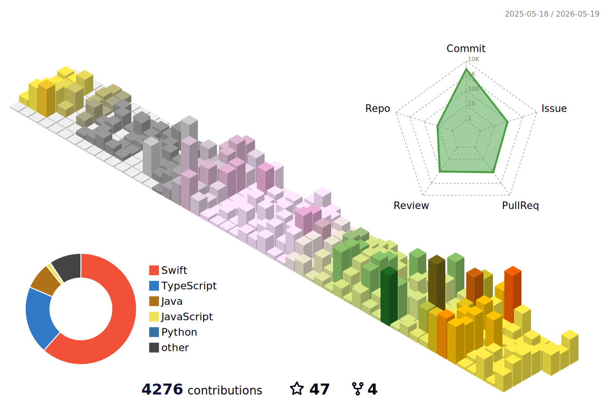

## ROY's GITHUB

<!--  -->
  
  
  ### HI There 

  
  

  

  
Hello, I'm Roy  
Thank you for visiting my github.  
    
  
⛺️ I  studying IOS in [라이징 캠프](https://risingcamp.com)  
⛺️ I  studyied iOS in [Udamy  iOS & Swift](https://www.udemy.com/course/ios-13-app-development-bootcamp/) 
⛺️ I studied iOS in [앨런 Swift문법 마스터 스쿨](https://www.inflearn.com/course/%EC%8A%A4%EC%9C%84%ED%94%84%ED%8A%B8-%EB%AC%B8%EB%B2%95-%EB%A7%88%EC%8A%A4%ED%84%B0-%EC%8A%A4%EC%BF%A8#curriculum) 
⛺️ I studyied iOS in [Yagom iOS code-strater camp ](https://www.yagom-academy.kr/camp/code-starter) 
⛺️ [코딩 클럽](https://github.com/orgs/Swift-Coding-Club/repositories) 전운영진 및 멘토  
⛺️ [DDD 운영진 ](https://www.instagram.com/dynamic_ddd/) 
  
 

  👋&nbsp; Hi there! I'm <b>mobile ios developer</b> 
 
  I enjoy listening music .traveling , playing game  ⛰ 🏄 
  I hope  Someone who can explain the code line by line   

## Projects

>**Currently working on**
- [WeaveDI](https://github.com/Roy-wonji/WeaveDI) - WeaveDI(DiContainer)를 쉽고 호환성이 잘되게 만든 라이브러리
- [DDD 출석앱](https://github.com/DDD-Community/Attendance_iOS_2024) - DDD 출석앱 / SwiftUI /TCA /Tuist / Reactorkit
- [TUIST 템플릿](https://github.com/Roy-wonji/MultiModuleTemplate) - Tuist 모듈 템플릿
- [쓰담](https://github.com/SpartCodig-iOS/SseuDam) - 여행 가계부앱  SwiftUI / TCA/ Tuist
- [DDD Opeace](https://github.com/DDD-Community/OPeace) - DDD 오피스 앱 / SwiftUI / TCA/ Tuist
- [AsyncMoya](https://github.com/Roy-wonji/AsyncMoya) - Moya를 좀더 간편하게 사용 하는 라이브러리
- [LogMacro](https://github.com/Roy-wonji/LogMacro) - Log 를 사용하기 쉽게 메크로 형식및 일반 타입으로 만든 라이브러리
- [AsyncURLSession](https://github.com/Roy-wonji/AsyncURLSession) - URLSession 을 간편하게 사용하는 라이브러리
- [DDD 9th(명언 제과점)](https://github.com/DDD-Community/PINGPONG-IOS) - 명언 제과점 / SwiftUI /MVVM /Tuist
- [Affinity](https://github.com/Swift-Coding-Club/TogetherApp) - 신발  커뮤니티 어플 / SwiftUI/MVVM
- [코인 모야](https://github.com/Swift-Coding-Club/TossSecuritiesStockCloneAPP) - 초보자들을 위한 주식앱 / SwiftUI/MVVM
- [한다](https://github.com/Swift-Coding-Club/TodoList) - 오늘 할일을 매일 작성하는 todolist  / SwiftUI/MVVM

  
## Experience
> [DDD 9th](https://www.instagram.com/dynamic_ddd/)  
> [DDD 9th Project](https://github.com/DDD-Community/PINGPONG-IOS) 

 
 
 
## 🛠 Skills & Tools 🛠

         
  
<h2 > ✨ Dev log </h2>
 

 
  
  
<!--     -->
   
   
  
  
  
 
  
   
  
   
  

  
  
 
  

  
<!--
**suhwj/suhwj** is a ✨ _special_ ✨ repository because its `README.md` (this file) appears on your GitHub profile.

Here are some ideas to get you started:

- 🔭 I’m currently working on ...
- 🌱 I’m currently learning ...
- 👯 I’m looking to collaborate on ...
- 🤔 I’m looking for help with ...
- 💬 Ask me about ...
- 📫 How to reach me: ...
- 😄 Pronouns: ...
- ⚡ Fun fact: ...
-->
